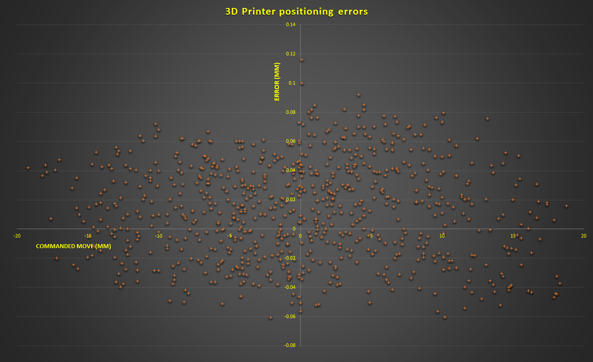
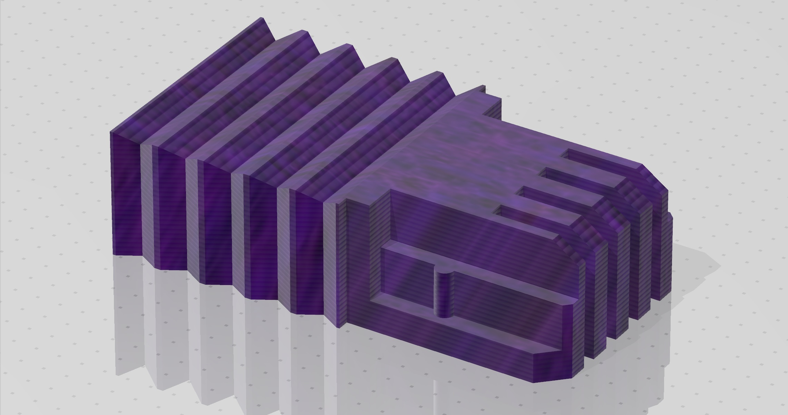
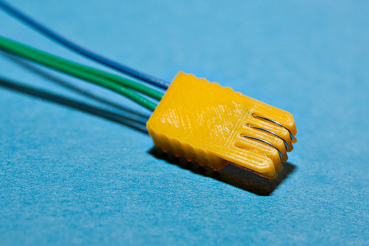
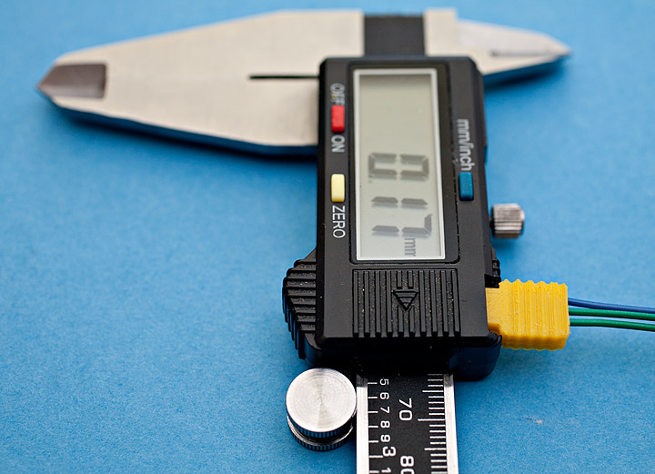
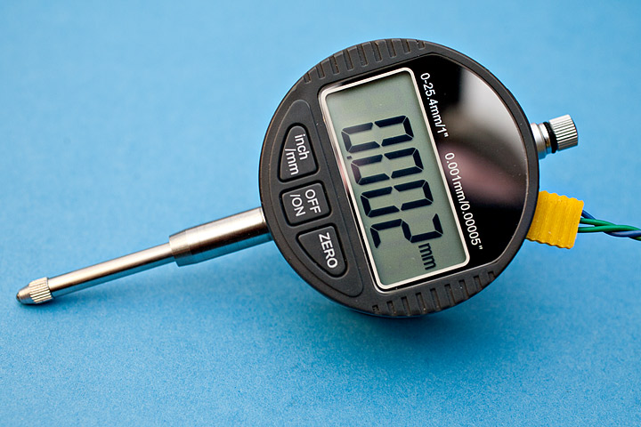
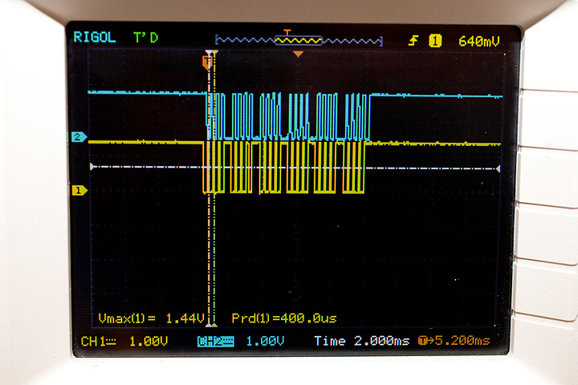
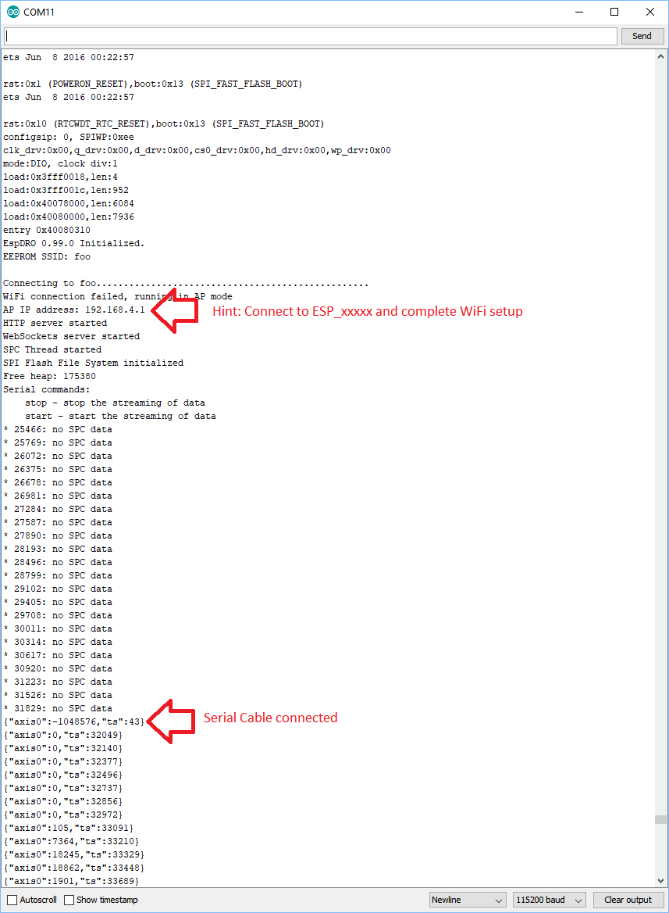
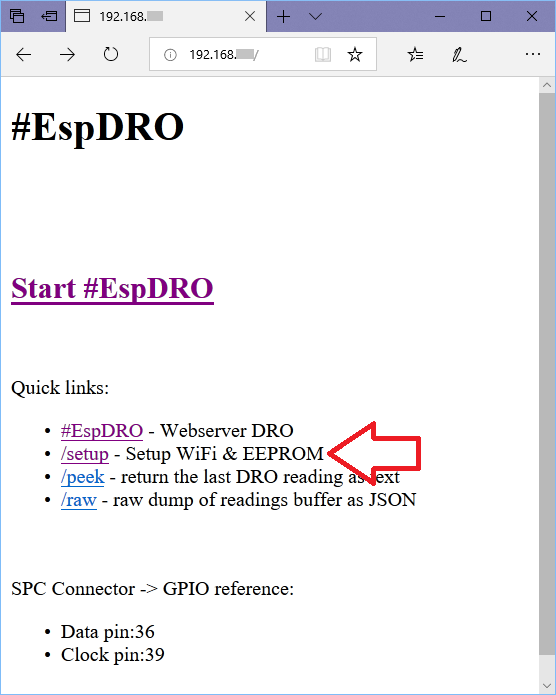
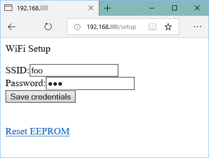

EspDRO - ESP32 DIY Digital Readout
----

EspDRO reads and proxies data from SPC capable (serial) digital calipers and indicators without any additional electronical components but using instead the built-in ADC in ESP32. It allows building custom, high-resolution measuring instruments, fully capable DRO (Digital Readout) panels for CNC/3D Printers, upgrade open-loop robots to closed-loop, point cloud 3D scanners, etc.

It costs ~$10 to build and it's only 500 lines of code - it's amazing how powerful and affordable IoT chips (like ESP32) have become. 

Overview:
---
- Reads and re-transmits the instrumet data over multiple channels:
    - **WebSockets broadcasting**: allows building simple, low latency clients (10 lines of code python sample [PyDRO](examples/PyDRO) included as well as offline JavaScript/HTML [jsDRO](/examples/jsDRO) )
    - **Built-in web server**:  allows reading the data from browser/phone/tablet without any additional apps. Big display!
    - **REST APIs** and mDNS support: to build thin client apps easily
    - **USB serial**: for running without WiFi
        
- Protocol and interfacing:
    - ESP32 reads the 1.5V SPC signal via the ADC in ESP32, therefore **no additional level shifting electronic components necessary**
    - **Automatic baud rate**: it reads as fast as the instrument can transmit, in practice however most cheap devices seem to send packets at 8-10Hz
    - **Built-in 4KB buffer** for historical reads - easy to extend if there is free memory on the chip
    - Data is read on a separate thread to avoid packet loss (can be moved on a different CPU core in ESP32)

- Other (fine touches):
    - **Automatic Access Point -> Client mode**: Includes WiFi setup page and saves credentials in EEPROM, so it does not need to be reflashed when going to a different location
    - **Automatic units conversion**: EspDRO works only with microns internally which means readings remain constant even if you change the units SAE<->metric while you measure. Keeps things simple.
    - **Self-documented Pinout**: for those instances when wires come loose and memory doesn't help
    - **mDNS advertising**: allows instrument names to be decoupled from knowing IP address
    - **3D Printable SPC connector**: 
        - All you need is 3 wires to make a SPC connector (4 wires if you want to power the instrument from ESP32, example using AMS1117 1.5v voltage regulator)
        - Tested to work on both calipers and indicators (slightly different commercial connectors).
        - Thingiverse page: https://www.thingiverse.com/thing:3141366

Bacgkround:
----
This project started with my need to diagnose the positioning errors in one of my 3D printers: I had both 1-micron and 10-micron resolution indicators and calipers but measuring manually (write down readings from the instrument LCD) would have taken way too much time and effort. Since I had an ESP32 laying around, I figured I'd give that a try and I was amazed how easy it was to automate the whole thing: command the 3D printer via G-Code, then read the calipers/indicator via ESP32. Of course that in the process of building the instrument people seeing the data started asking for the firmware, so I decided to put some "finishing touches" (yeah, that really means 10x more lines of code :) ) and publish it, but also as a PIF for others that have posted useful guides around this space and helped me build this quickly. That's how #EspDRO came up.

Installation:
----
_Software prerequisites_:

Arduino with ESP32 support, including [esp32fs filesystem uploader plugin](https://github.com/me-no-dev/arduino-esp32fs-plugin) 

_Hardware prerequisites_:
- Espressif ESP32. The particular board this firmware was developed with is this (if yours is different, adjust dataPin and clockPin in the source): 
    - 
- SPC serial cable: if you don't have one you can use the [3D printable connector](CAD/spc_connector.stl), see [thingiverse page](https://www.thingiverse.com/thing:31413660) for more info. 
    -  
- Digital scale, calipers or DRO matching the connector. Examples:
    -  

Validate the cable works and the pinout in the firmware is correct. If you have an oscilloscope, the signal should look like this:
- 

Flash the webserver files (Tools->ESP32 Sketch Data Upload) and then upload the sketch/firmware. Start the serial monitor and you should see something like this:
- 

Note: If you don't have an oscilliscope and the data is not coming through, there is a #define DEBUG_SIGNAL which you can use to calibrate the Analog Digital Converter. This will also tell you if the pins on ESP32 are actually getting any analog data, as different dev boards have the ADC1_0 and ADC1_3 pins mapped differently than DevKitC above.

Now navigate to the main page and set up WiFi:
- 
- 

Finally, you should see this:
- 

Future plans (opportunities for contributors):
---
- **Multi-Axis**: Currently only one instrument supported but it's possible to extend EspDRO to multi-axis ($TODO, soon)
- **Time-of-Flight sensors**: One thing I'm really eager to add is (VL53L0X)[https://www.st.com/resource/en/datasheet/vl53l0x.pdf] Time-of-Flight sensor, this should be able to read at 15-50Hz and +/-3% accuracy and without touching (influencing) the measured object. 
- **TTL glass scale**:  these are more expensive devices used in large mill DROs and can have 0.5-5 microns accuracy and extreme lengths (1+ meters)
- **Mill DRO functions**: implement common functions in DRO (find mid-point, center of circle, create hole patterns, datum points, absolute/incremental, memory, units conversion, etc)
- **Live charting**: 1-3 axis charting directly built-in the web console: for example to build a print bed mesh map (or 2.5D/3D point cloud) or axis error scatter plot 
- **Bluetooth support**: since ESP32 has BT, why not add a 5th interface?
- **Digital micrometer support**: Dicfeos and similar are affordable and micron-level accuracy - connector is different and can't be 3D printed. Less of a priority, as these require manual operation to measure.
